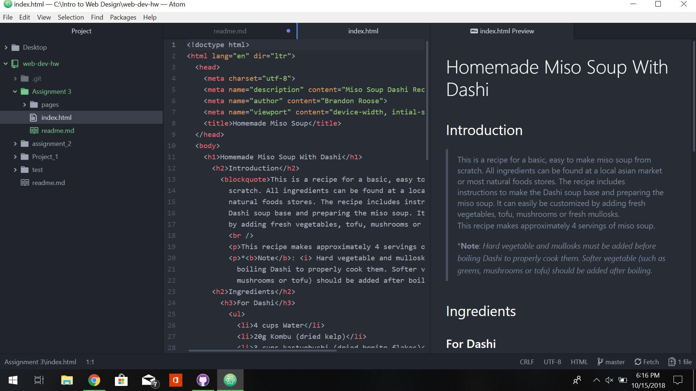

# Assignment 3 Technical Report

### Head and body Element

There can technically be any number of ```<head>``` and ```<body>``` elements in a page, however browsers will find it difficult, or impossible to interpret multiples of these element. So only one of each element is strongly recommended.

The ```<head>``` element contains the high level information for a page, such as the title, character set, author, etc. and is not visible to visitors. The ```<body>``` element contains all contents and formatting that will be displayed to the page user.

### Structural and Semantic Markup

Structural markup is essentially the formatting of the text on a page. This is includes elements such a headers, line breaks, paragraphs, etc.. Semantic markup is used for emphasis or used for citation or definitions in text.

### Work Summary

The workflow for this project was fairly straight forward setting headers for the introduction, ingredients and instructions. I used bold semantic markup to emphasize important notes in the recipe. No notable problems occurred.


