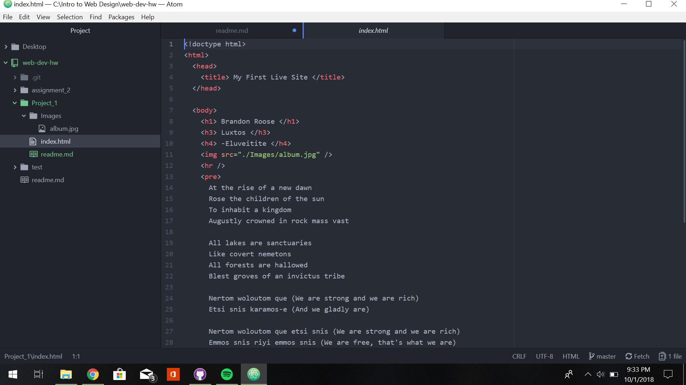

# First Project Technical Report

### Browsers used for surfing
* Google Chrome
* Firefox

#### Internet browsers function by the interaction of 4 components of the browser.
1. The user interface which contains that layout of the web page and all of the navigation features.
2. The rendering engine which draws all of the visuals coded into the webpage.
3. The browser engine which coordinates actions between the user interface, rendering engine and external servers.
4. The network connection, the browser uses the network to access and/or retrieve the various links and URLs for images and such.

### The Wayback Machine
Visiting Kodak.com from April 1996, the layout was simplistic with several buttons for information about the company and its products. It seems more focused on showing people the company rather than the product. Jumping to April 2018, the site is much more flashy with interactive images and seems more focused on advertising the product and what it can do rather than what the company is about.

##### Work Cycle Report
  This project was an introduction to writing basic HTML language and exploring the basic elements of the language. The first step was creating an initial index.html file with a declared doctype and headers along with paragraph formatting and embedded images. There was some issues getting the image to post to the website which was caused by a simple coding error.

  
